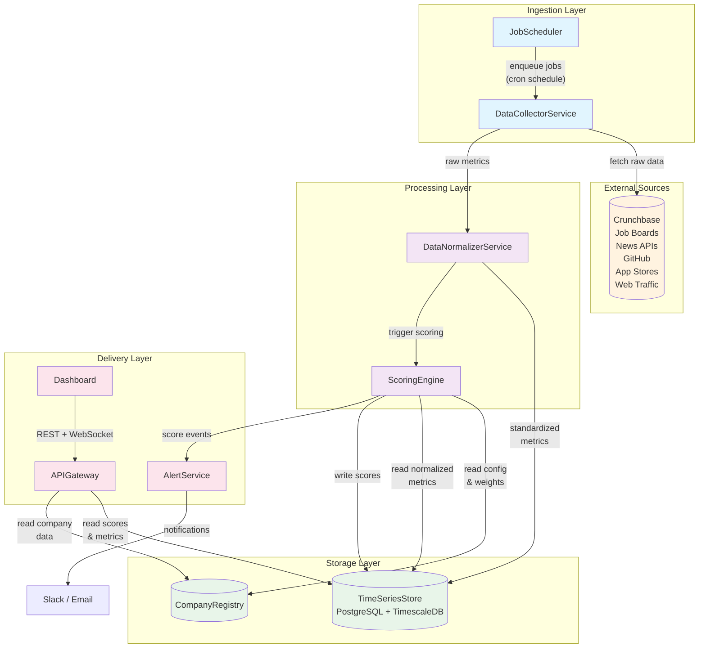

# Architectural Blueprint

## 1. Core Objective

Build a **Portfolio Company Health Monitoring Platform** that enables a VC firm's back-office team to continuously track the health of its portfolio startups through a single composite score. The platform ingests publicly available internet data on a recurring schedule, normalizes signals across categories (hiring, funding, web presence, sentiment, product traction), computes a weighted health score per company, and presents trends and drill-downs through a real-time dashboard. **Success** looks like: every portfolio company has a current, explainable health score updated at least daily, with the team able to spot deteriorating companies before problems surface in quarterly reports.

## 2. System Scope and Boundaries

### In Scope
- Scheduled ingestion of publicly available data from web sources (Crunchbase, job boards, news, app stores, GitHub, web traffic estimators)
- Pluggable scraper/collector architecture — easy to add new data sources over time
- A configurable scoring engine that normalizes raw metrics to a 0–10 scale and computes a weighted composite health score per company
- Score category breakdown: Hiring Momentum, Funding & Financials, Web Presence & Traffic, Public Sentiment & News, Product Traction
- Historical score storage with time-series queries (trend lines, period comparisons)
- A web dashboard for the back-office team: portfolio overview, company detail, score history, alerts
- Role-based access (Admin, Analyst, Viewer)
- Alert/notification system when a company's score drops below a configurable threshold

### Out of Scope
- Ingesting private/confidential data from portfolio companies (financial statements, board decks)
- Direct integrations with portfolio company internal systems (ERP, accounting)
- LP-facing reporting or fund-level analytics
- Mobile native applications (responsive web only)
- AI/ML-driven predictive models (v1 uses deterministic weighted scoring; ML is a future enhancement)
- Real-time streaming ingestion (the platform uses scheduled batch/micro-batch collection)

## 3. Core System Components

| Component Name | Single Responsibility |
|---|---|
| **DataCollectorService** | Orchestrates and executes scheduled scraping/API jobs to fetch raw public data for each portfolio company from external sources. |
| **DataNormalizerService** | Cleans, validates, and transforms raw collected data into standardized metric records with consistent schemas and units. |
| **ScoringEngine** | Computes per-category scores (0–10) from normalized metrics and aggregates them into a single weighted composite health score per company. |
| **CompanyRegistry** | Manages the portfolio company catalog — metadata, data source mappings, scoring weight overrides, and company lifecycle state. |
| **TimeSeriesStore** | Persists all metric snapshots and computed scores as time-series data, supporting historical queries, trend analysis, and continuous aggregates. |
| **AlertService** | Monitors score changes against configurable thresholds and dispatches notifications (email, Slack webhook) when scores breach alert rules. |
| **APIGateway** | Exposes a RESTful + WebSocket API that serves the dashboard frontend, handles authentication/authorization, and mediates access to all backend services. |
| **Dashboard** | A Next.js web application providing the portfolio overview, company detail views, score trend charts, alert management, and admin configuration screens. |
| **JobScheduler** | Manages the recurring job queue — enqueues collection jobs on cron schedules, handles retries, rate limiting, and dead-letter processing. |

## 4. High-Level Data Flow

## 5. Key Integration Points

- **JobScheduler → DataCollectorService**: BullMQ Redis-backed job queue. The scheduler enqueues typed jobs (`collect:crunchbase`, `collect:github`, etc.) on configurable cron intervals. Workers consume jobs with concurrency limits and automatic retries with exponential backoff.
- **DataCollectorService → External Sources**: HTTP requests via `fetch`/`axios` for API-based sources; Playwright headless Chromium for JavaScript-rendered pages. Rotating proxy pool for rate-limit management. Each collector implements a common `IDataCollector` interface.
- **DataCollectorService → DataNormalizerService**: In-process function call within the same worker. Raw responses are passed to source-specific normalizer adapters that output a uniform `MetricRecord` schema.
- **DataNormalizerService → TimeSeriesStore**: Prisma ORM writes normalized `MetricRecord` rows to TimescaleDB hypertables, partitioned by timestamp.
- **ScoringEngine → TimeSeriesStore + CompanyRegistry**: Reads the latest normalized metrics from TimescaleDB and scoring configuration (weights, thresholds) from the CompanyRegistry tables. Writes computed `ScoreSnapshot` records back to TimescaleDB.
- **ScoringEngine → AlertService**: After computing a new score, emits a score-change event. The AlertService evaluates it against company-specific or global alert rules and dispatches notifications.
- **APIGateway → TimeSeriesStore + CompanyRegistry**: REST endpoints serve paginated, filtered queries. WebSocket connections push real-time score updates to connected dashboard clients.
- **Dashboard → APIGateway**: Next.js app uses `fetch` for SSR data loading and a WebSocket client for live updates. Authentication via JWT tokens issued by the APIGateway.
- **Authentication**: JWT-based auth with role claims (Admin, Analyst, Viewer). API Gateway validates tokens on every request. Refresh token rotation for session management.
- **Data Format**: All internal communication uses JSON. `MetricRecord` and `ScoreSnapshot` are the two canonical data shapes, defined as shared TypeScript types in a `packages/shared` workspace package.

## 6. Technology Stack Summary

| Layer | Technology |
|---|---|
| Language | TypeScript (end-to-end) |
| Runtime | Node.js 20+ |
| Backend Framework | Fastify (high-performance HTTP + WebSocket) |
| ORM | Prisma |
| Database | PostgreSQL 16 + TimescaleDB extension |
| Job Queue | BullMQ + Redis |
| Scraping | Playwright (JS-rendered), Cheerio (static HTML) |
| Frontend | Next.js 14 + React, Recharts, Tailwind CSS |
| Auth | JWT (jose library) |
| Monorepo | Turborepo with `packages/shared`, `apps/api`, `apps/web`, `apps/workers` |
| Containerization | Docker Compose (dev), Docker (prod) |
| Notifications | Slack Incoming Webhooks, SendGrid (email) |
